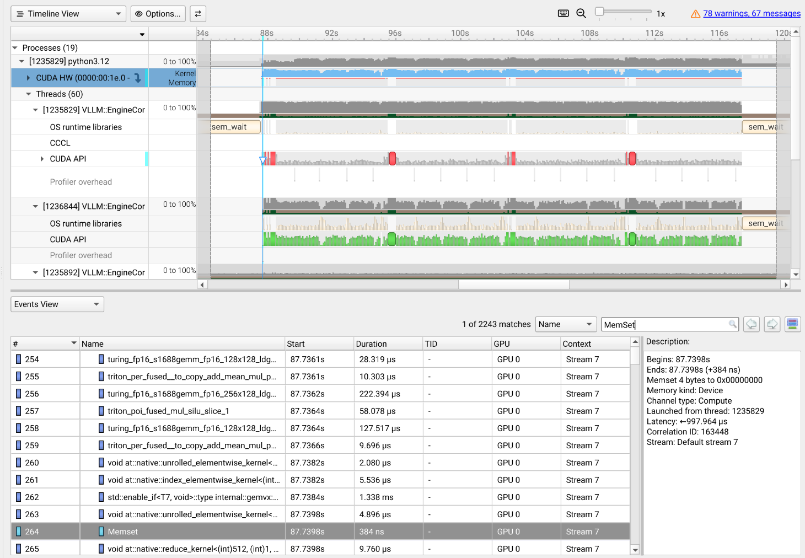
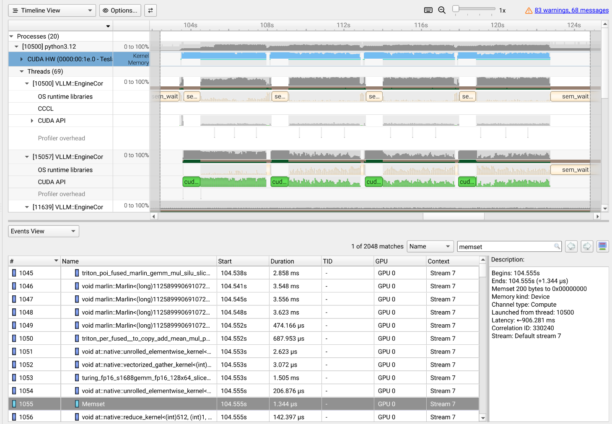
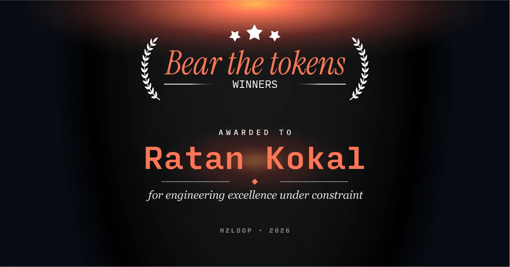

# Optimizing Qwen2.5-0.5B Inference on a Tesla T4

## The Challenge: Bear the Tokens

H2LooP’s *Bear the Tokens* was an inference optimization challenge focused on extracting maximum performance from a fixed model and hardware setup. The goal was to optimize the complete serving stack while preserving reliability.

### Hardware

* **GPU:** NVIDIA Tesla T4
* **Memory:** 16 GB

### Software and Workload

* **Model:** Qwen2.5-0.5B
* **Serving framework:** vLLM
* **Concurrent requests:** 50
* **Input tokens per request:** 512
* **Output tokens per request:** 512
* **Evaluation harness:** `vllm bench serve`

### Goal

The objective was to push output throughput as high as possible while satisfying the challenge’s latency and reliability constraints. The initial baseline was approximately **3,332 output tokens per second**.

Participants could modify the inference stack, including batching, scheduling, quantization, CUDA kernels, memory management, and speculative decoding, but the model, hardware, workload, and evaluation setup were fixed.

## The Optimization Journey

I approached the challenge as an end-to-end systems problem. I first established a baseline, then profiled the serving path and measured the effect of each major change.

| Stage    | Main change                             |        Throughput |
| -------- | --------------------------------------- | ----------------: |
| Baseline | Default vLLM configuration              |       3,332 tok/s |
| 1        | Engine tuning and AWQ exploration       |       3,800 tok/s |
| 2        | CUDA graph capture and sampling changes |       4,300 tok/s |
| 3        | CPU–GPU synchronization removal         | 4,500–4,600 tok/s |
| 4        | Adaptive batching scheduler             |       5,600 tok/s |
| 5        | AWQ-Marlin kernels                      |       5,800 tok/s |
| 6        | SIMT attention and 7:1 GQA support      |       6,822 tok/s |

## Stage 1: Tuning the Engine Configuration

I began by tuning vLLM’s engine parameters:

* `max-num-seqs`
* `max-num-batched-tokens`
* `max-model-len`
* GPU memory utilization
* KV-cache block size
* Quantization format

The objective was to maximize GPU utilization without causing an out-of-memory error.

The configuration was matched to the fixed workload:

```bash
--max-num-seqs 50
--max-num-batched-tokens 25600
--max-model-len 1024
--gpu-memory-utilization 0.925
--block-size 32
```

The batch-token limit was chosen based on:

```text
50 requests × approximately 512 tokens = 25,600 tokens
```

I also explored AWQ quantization to reduce memory usage and improve matrix multiplication efficiency.

These changes increased throughput from approximately **3,332 to 3,800 tokens per second**.

## Stage 2: CUDA Graph Capture and Sampling Overhead

The benchmark sent requests at an effectively infinite rate. Once the system reached steady state, the hot path frequently contained all 50 requests.

vLLM uses CUDA graphs to reduce CPU dispatch and kernel-launch overhead. However, graphs must be captured for predefined batch sizes. If the runtime batch size does not match an available capture size, execution can fall back to a slower path.

I added capture sizes covering the expected workload, including the full batch size:

```text
[1, 2, 4, 8, 16, 24, 32, 40, 50]
```

This was especially important in Google Colab, where the CPU environment was relatively weak. CPU-side dispatch and kernel-launch overhead formed a larger fraction of total execution time than they would in a stronger server environment.

I also observed that non-zero-temperature inference launched additional sampling-related work, including softmax operations. Since stochastic sampling was not required, I used greedy decoding:

```text
temperature = 0
```

These changes increased throughput to approximately **4,300 tokens per second**.

## Stage 3: Eliminating CPU–GPU Synchronization

Nsight Systems profiling revealed hidden CPU–GPU synchronization in vLLM’s attention metadata path.

Some sequence-length metadata was accessed through implicit `.cpu()` operations. These forced the CPU to wait for GPU work to complete before continuing, creating pipeline stalls.

I modified the execution path to:

* Remove implicit `.cpu()` calls during attention execution
* Compute required CPU metadata explicitly
* Replace blocking copies with asynchronous copies where possible
* Update GPU-side block-table metadata using non-blocking transfers
* Avoid unnecessary full-table synchronization
* Remove redundant padded block-table initialization
* Compile sampling logic to reduce Python overhead

For example:

```python
self.block_table.gpu[row_idx, start:start + num_blocks].copy_(
    torch.from_numpy(np.asarray(block_ids, dtype=np.int32)),
    non_blocking=True,
)
```

I also removed redundant initialization:

```python
# Removed
blk_table_tensor[num_reqs:num_reqs_padded].fill_(-1)
```

The goal was to allow CPU-side preparation and GPU execution to overlap instead of forcing the CPU to wait.

These changes increased throughput to approximately **4,500–4,600 tokens per second**.

## Stage 4: Discovering the Scheduler Bottleneck

After reducing synchronization overhead, I profiled the serving workload again.

The trace showed that the scheduler was producing fragmented batches. Instead of consistently processing the available requests together, it repeatedly launched smaller batches:

```text
Before:
12 → 18 → 25 → 31 → 22 → ...

Desired:
50 → 50 → 50 → 50 → ...
```

Because requests arrived continuously and had identical input and output lengths, the scheduler could briefly wait for additional requests without significantly affecting performance.

I added an adaptive batching mechanism controlled by:

```bash
VLLM_MIN_QUEUED_REQS=50
VLLM_MIN_QUEUED_TIMEOUT=10ms
```

The scheduler waited until either:

1. The queue reached 50 requests, or
2. The 10 ms timeout expired.

This allowed it to form larger and more predictable batches while avoiding indefinite delays.

The Nsight traces showed that the scheduler execution count decreased from approximately **2,243 to 2,048**.



*Before adaptive batching: approximately 2,243 scheduler execution events.*



*After adaptive batching: approximately 2,048 scheduler execution events.*

The more regular execution pattern also improved CUDA graph reuse.

Throughput increased to approximately **5,600 tokens per second**.

## Stage 5: AWQ-Marlin Quantization

I next switched from standard AWQ execution to AWQ-Marlin.

Quantization reduces the model’s memory footprint, but the execution kernel is equally important. Marlin provides specialized kernels for AWQ-quantized matrix multiplications, reducing the latency of the dominant GEMM operations on the T4.

This increased throughput from approximately **5,600 to 5,800 tokens per second**.

The final serving configuration included:

```bash
vllm serve Qwen2.5-0.5B \
    --quantization awq_marlin \
    --gpu-memory-utilization 0.925 \
    --max-num-seqs 50 \
    --max-num-batched-tokens 25600 \
    --max-model-len 1024 \
    --block-size 32
```

## Stage 6: Optimizing Qwen’s 7:1 GQA Pattern

The final major optimization involved Qwen’s attention configuration.

Qwen2.5-0.5B uses grouped-query attention with:

* **14 query heads**
* **2 key-value heads**

This produces a **7:1 query-to-KV-head ratio**.

Many tensor-core-oriented implementations are optimized for power-of-two dimensions and grouping factors. A 7:1 pattern does not map naturally onto those assumptions, which can leave parts of the hardware underutilized.

I modified the attention path to use a SIMT-oriented implementation for this case and patched FlashInfer to support the group size of 7 directly.

This allowed the attention computation to better match Qwen’s actual tensor shape.

Throughput reached:

```text
6,822 output tokens per second
```

## Benchmarking Methodology

For each configuration, I first performed one dry run. This loaded the model, populated CUDA graphs, and ensured that the relevant data was resident in memory.

I then ran three normal benchmark runs using:

```bash
vllm bench serve \
  --base-url http://localhost:8000/v1 \
  --endpoint /completions \
  --model Qwen/Qwen2.5-0.5B \
  --tokenizer Qwen/Qwen2.5-0.5B \
  --dataset-name random \
  --random-input-len 512 \
  --random-output-len 512 \
  --max-concurrency 50 \
  --num-prompts 200 \
  --ignore-eos
```

The benchmark used an effectively infinite request rate and a maximum concurrency of 50.

For profiling, I ran a separate hot benchmark under Nsight Systems. The profiled run was not used for throughput reporting because profiler instrumentation adds overhead.

All configurations used the same model, workload, GPU, and benchmark settings.

## Final Results

Compared with the original baseline, the final system achieved:

| Metric                    | Improvement |
| ------------------------- | ----------: |
| Output throughput         |   **+118%** |
| P99 time-to-first-token   |    **−73%** |
| P99 time-per-output-token |    **−54%** |

The overall throughput progression was:

```text
3,332 tok/s → 6,822 tok/s
```

This improvement was achieved on the same Tesla T4 without changing the model, hardware, workload, or evaluation setup.

## What Made the Difference?

The final result came from aligning the entire inference stack with the workload:

1. Tuning engine parameters without causing OOM
2. Maximizing GPU memory utilization
3. Capturing the batch sizes used in steady state
4. Removing unnecessary sampling work
5. Eliminating implicit CPU–GPU synchronization
6. Making metadata transfers asynchronous
7. Removing redundant block-table operations
8. Building larger and more predictable scheduler batches
9. Using AWQ-Marlin matrix multiplication kernels
10. Supporting Qwen’s 7:1 GQA pattern with a SIMT-oriented path

The main lesson was that inference optimization is an end-to-end systems problem.

A fast kernel is not enough if the scheduler feeds it fragmented batches. Large batches are not enough if the CPU repeatedly waits for the GPU. CUDA graphs are not enough if the runtime frequently falls back to uncaptured shapes.

The largest gains came from removing inefficiency between components.

## Future Work: Multi-Token Decoding

One promising direction is multi-token decoding.

The workload is highly regular, with 50 similar requests and fixed input and output lengths. Instead of synchronizing between the CPU and GPU after every generated token, the system could attempt to generate several tokens before synchronizing and validating the result.

For example, it could attempt to predict eight tokens before performing a synchronization step. This could reduce synchronization frequency and hide more CPU-side overhead.

Such an approach would require careful handling of correctness, rollback, and token acceptance, but it could potentially push throughput beyond the current result.

## Conclusion

The competition began with a baseline of approximately **3,332 tokens per second**. Through profiling and incremental optimization, I reached **6,822 tokens per second**, more than doubling throughput on the same NVIDIA Tesla T4.

The experience reinforced a broader principle:

> High-performance inference is not about optimizing one component in isolation. It is about making the scheduler, runtime, memory system, CUDA graphs, quantization kernels, and attention implementation work together.



*Awarded first place in H2LooP’s Bear the Tokens challenge for “engineering excellence under constraint.”*
